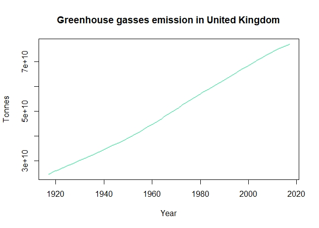
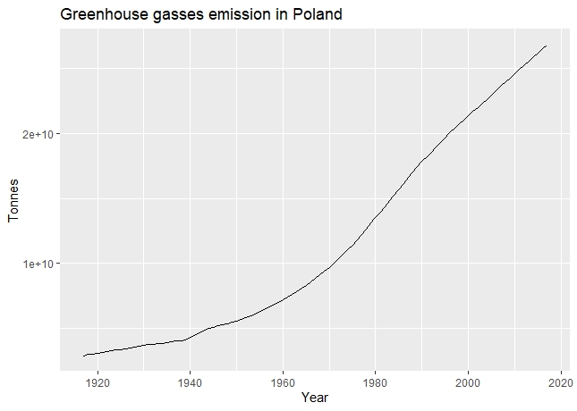
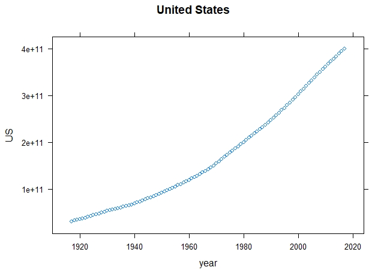
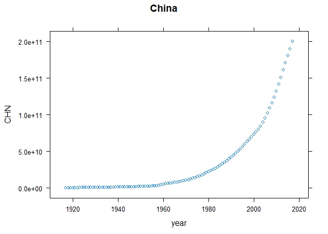
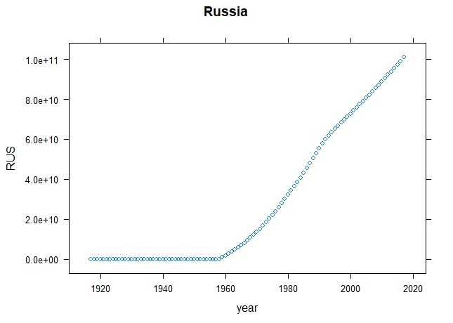
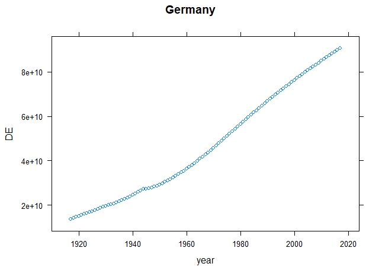
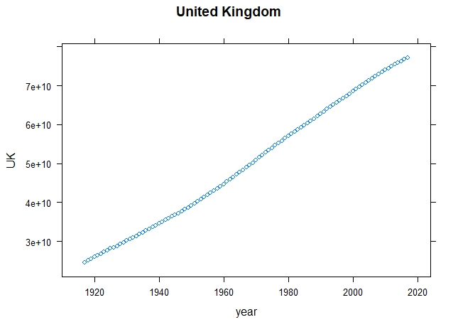
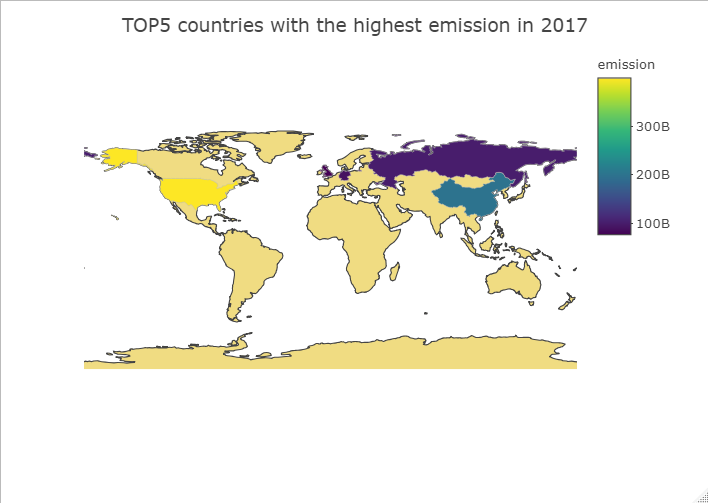

# Greanhouse gasses emission around the world since 1750 and until 2017

### Table of contents
   + [Intro](#intro)
   + [Used packages](#used-packages)
   + [Data preparation](#data-preparation)
   + [United Kingdom data](#united-kingdom-data)
   + [Polish emission data](#polish-emission-data)
   + [TOP5 countries with highest emission in 2017](#top5-countries-with-highest-emission-in-2017)
   + [TOP5 map](#top5-map)

### Intro
This project is an analysis and visualization of greenhouse gasses emission data.
Original data file is [here](https://github.com/msusz/Greenhouse_Gasses_Emission/blob/main/Suszczyk_dane_surowe.csv).
This file contains a series of measurments of greenhouse gasses emission by every country in the world.

### Used packages
R packages used in the code:
- tidyverse
- lattice
- forecast
- ggplot2
- plotly  

Before running the code make sure that you have all of above installed.

### Data preparation
First 50 years covered by the data are mostly zeros, as not many countries were collecting such data since 1750. First column in the data file is filled with countries.The most useful data preparation will include creating a data frame containing first column (countries names) and measures since 1800 and until 2017.
Prepared data are stored in another CSV file - [here](https://github.com/msusz/Greenhouse_Gasses_Emission/blob/main/Suszczyk_dane_przeksztalcone.csv).

### United Kingdom data
United Kingdom emission stands out from the rest of the world. Data were collected way before other countries started to take measurments. Lets look at the plot of emission over the years.  
  
As you can see, emission level was increasing at a steady pace in the examined peroid of time.

### Polish emission data
  
Polish emission increase is less stable. On the plot we can see effects that the World War II had on this country. During the war emission rised, possibly due to the rise in importance of heavy industry. Then, after the war ended, everything slowed down. Emission was still increasing, but slower, untill it reached quite stable level of growth around 1990.

### TOP5 countries with highest emission in 2017
  
United States had the highest emission in 2017. On the plot we can see, that the increase was steady and constant in the examined peroid of time.  
  
Second country in the ranking is China. It is the fastest growing economy in the world, what is clearly visible on the emission plot. Emission growth is the most rapid, and during last fifty years it increased from almost none to the second highest world emission amount.  
  
Russian emission data are starting with a series of zeros followed by a rapid growth. This indicates that the measures started fairy late, compared to other countries.  
  
Plot for Germany, simirally to polish one, shows that emission slowed down after the World War II.  
  
As I mentioned before, emission for United Kingdom was increasing at a steady pace the whole time.

### TOP5 map
Here is a map of the world with highlited countries discussed in previous paragraph:  

